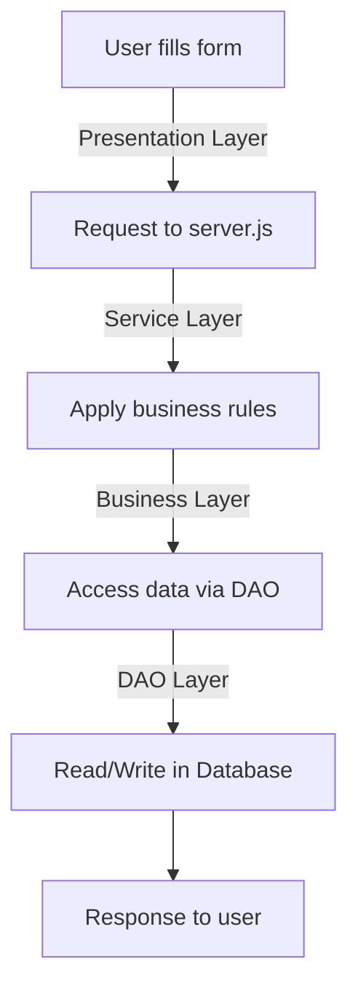

# Smart IoT Data Dashboard – DHT11 & ESP32

**Supervisor:** ENNOUAARY Abdeslam

**Team Members:** SARAOUI Zineb | BAKRIM Sana | **ADAMMICHE Zineb** | BENALI Amine

**Institution:** INPT – Master IoT & Big Data


---

## 📌 Project Description
This project is a **smart IoT system** designed to collect, store, and visualize **temperature and humidity** measurements using a **DHT11 sensor** connected to an **ESP32**. The architecture follows a **multi-layer professional approach**:

**Principle:**
`Presentation → Service → Business → DAO → Data`

**Objectives:**
- Separate responsibilities
- Facilitate maintenance
- Make the project scalable and professional

---

## 🏗️ Project Architecture

### 1️⃣ Presentation Layer (Front-end)
**Folder:** `PresentationLayer/`
**Files:**
```bash
homePage.html
mainPage.html
authenticationPage.html
registrationPage.html
addSensorPage.html
addTemperaturePage.html
aboutPage.html
styles.css
```
**Role:**
- Display HTML pages to the user.
- Manage user interactions (forms, buttons, navigation).
- Send requests to the server (login, add sensor, etc.).

> ⚠️ **No business logic here**, only presentation and user interaction.

---

### 2️⃣ Service Layer (API / Backend)
**Folder:** `ServiceLayer/`
**File:** `server.js`

**Role:**
- Start the Node.js/Express server.
- Define API routes: `/login`, `/register`, `/addSensor`, `/getSensors`.
- Receive requests from the front-end and call the Business layer.

> **Bridge between the front-end and business logic.**

---

### 3️⃣ Business Layer (Business Logic)
**Folder:** `BusinessLayer/`
**Files:**
```bash
businessManager.js   # Manages main features: sensors, users, IoT data
securityManager.js   # Authentication, authorization, security
guiManager.js        # Prepares data for front-end display
```
**Role:**
- Contains business rules.
- Validates data consistency.
- Applies functional logic.

> **Core of the project 🧠**

---

### 4️⃣ DAO Layer (Data Access)
**Folder:** `DAOLayer/`
**File:** `DAOManager.js`

**Role:**
- Communicates with the database.
- Executes CRUD operations (Create, Read, Update, Delete).

> **The Business layer never accesses the database directly; it goes through the DAO.**

---

### 5️⃣ Data Layer (Database)
**Folder:** `DataLayer/`
**Files:**
```bash
database.js          # Database configuration: MySQL, SQLite, MongoDB, etc.
databaseManager.js   # Overall database management
users.js             # User model
sensors.js           # IoT sensor model
```
**Role:**
- Define tables/collections.
- Manage database connection.

> **Lowest layer, independent of others.**

---

### 6️⃣ Root Files
```bash
package.json  # Dependencies (Express, express-session, etc.) and scripts (npm start)
styles.css    # Global styles
```

---

## 🔁 Example Workflow (Login)


---

## ⚙️ Prerequisites
```bash
Node.js ≥ 14.x
npm or yarn
Arduino IDE or VSCode with PlatformIO
ESP32 + USB cable
DHT11 sensor
```

---

## 🚀 Launching the Project

### 1️⃣ Program the ESP32
1. Open `Arduino/Temp_Humidity_DHT11_ESP32.ino` in Arduino IDE.
2. Connect the ESP32 to your PC via USB.
3. Check the corresponding **COM port**.
4. Upload the sketch to the ESP32.

**DHT11 → ESP32 Wiring:**
| ESP32 Pin | DHT11 Pin |
|-----------|-----------|
| 3.3V      | VCC       |
| GND       | GND       |
| D21       | DATA      |

---

### 2️⃣ Start the Node.js Backend
```bash
cd ServiceLayer
npm install
node server.js
```
The server listens by default on [http://localhost:3000](http://localhost:3000).

---

### 3️⃣ ESP32 Data Logging and Server Logs
**Example Server Log:**
```json
{
  "event": "IoT Data Received",
  "data": {
    "cluster": "ESP32_Cluster",
    "sensor": "DHT11_ESP32",
    "temperature": 19.2,
    "humidity": 93
  }
}
```

---

### 4️⃣ Troubleshooting ESP32 Data Issues
**Repeated or Stale Data:**
- Check sensor connections (DHT11 to ESP32).
- Verify the ESP32 code for new data in each loop iteration.

**No Data Received:**
- Ensure the ESP32 is connected to the same network as the server.
- Check the server IP and port in the ESP32 code.

---

### 5️⃣ Open the Web Interface
```bash
Open PresentationLayer/homePage.html in your browser at http://localhost:3000/home
```

---

## 📦 Features
- Real-time temperature and humidity monitoring.
- Visualization via lists and dashboard.
- Multi-user management and security through `securityManager.js`.

---

## 🔗 Dependencies
```bash
Express.js    # HTTP server
Node-Fetch    # HTTP requests
DHT Library   # Arduino sensor library
```

---

## 💻 Authors
**Supervisor:** ENNOUAARY Abdeslam
**Team:** SARAOUI Zineb | BAKRIM Sana | ADAMMICHE Zineb | BENALI Amine
**Institution:** INPT – Master IoT & Big Data
